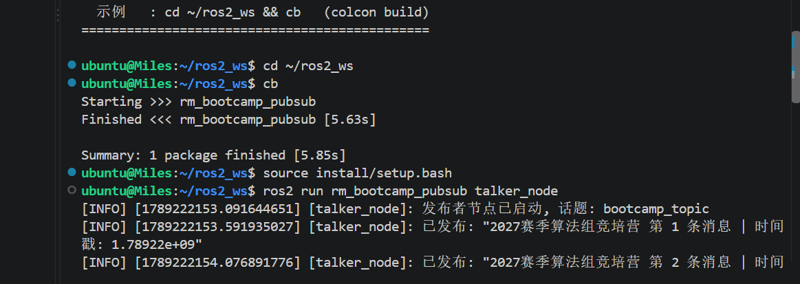
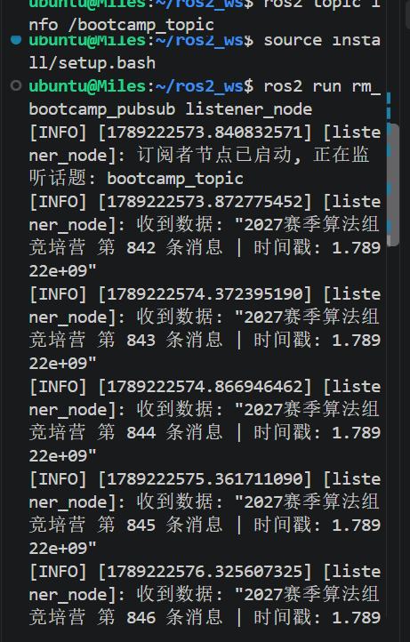
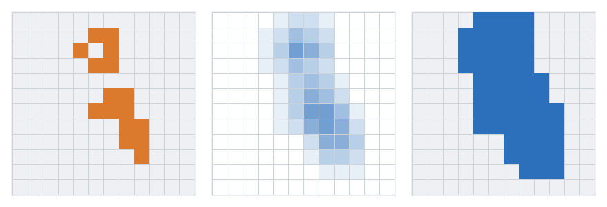
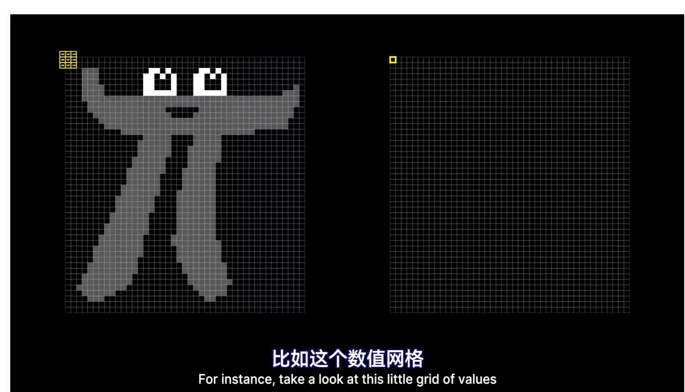

# 2027 赛季算法组竞培营 · 第一周任务 提交文档

| 项目 | 内容 |
|---|---|
| 姓名 / 组别 | （填写） |
| 完成任务 | 任务一：ROS2 消息发布 / 订阅与日志输出（3.4.2）；任务二：区域膨胀算法（4.5） |
| 仓库链接 | <https://github.com/li15539942558/2027-algorithm-bootcamp> |
| 运行环境 | Ubuntu 22.04（WSL2）+ ROS2 Humble；g++ 11.4 / cmake 3.22（任务二在 Windows + MinGW 下同样通过） |
| 提交日期 | 2026-09-12 |

> 文中的矩阵、终端输出都是在本机真实编译运行后得到的；标注 `📷` 的位置插入本人截图。

---

## 一、任务一：ROS2 消息发布 / 订阅与日志输出

### 1.1 包结构

新建 workspace `~/ros2_ws`，包名 `rm_bootcamp_pubsub`，包下有两个可分别执行的节点：

```
~/ros2_ws/src/task1_ros2_pkg/
├── package.xml
├── CMakeLists.txt
└── src/
    ├── publisher_node.cpp   # 发布节点 → 可执行文件 talker_node
    └── subscriber_node.cpp  # 订阅节点 → 可执行文件 listener_node
```

### 1.2 发布节点

每 0.5 s 往话题 `bootcamp_topic` 发一条字符串，内容自定（带序号和时间戳）：

```cpp
// publisher_node.cpp
#include <chrono>
#include <memory>
#include <sstream>
#include "rclcpp/rclcpp.hpp"
#include "std_msgs/msg/string.hpp"

using namespace std::chrono_literals;

class PublisherNode : public rclcpp::Node {
public:
    PublisherNode() : Node("talker_node"), count_(0) {
        publisher_ = this->create_publisher<std_msgs::msg::String>("bootcamp_topic", 10);
        timer_ = this->create_wall_timer(500ms, std::bind(&PublisherNode::onTimer, this));
        RCLCPP_INFO(this->get_logger(), "发布者节点已启动, 话题: bootcamp_topic");
    }
private:
    void onTimer() {
        auto message = std_msgs::msg::String();
        ++count_;
        std::ostringstream oss;
        oss << "2027赛季算法组竞培营 第 " << count_ << " 条消息 | 时间戳: " << this->now().seconds();
        message.data = oss.str();
        publisher_->publish(message);
        RCLCPP_INFO(this->get_logger(), "已发布: \"%s\"", message.data.c_str());
    }
    rclcpp::Publisher<std_msgs::msg::String>::SharedPtr publisher_;
    rclcpp::TimerBase::SharedPtr timer_;
    size_t count_;
};

int main(int argc, char* argv[]) {
    rclcpp::init(argc, argv);
    rclcpp::spin(std::make_shared<PublisherNode>());
    rclcpp::shutdown();
    return 0;
}
```

### 1.3 订阅节点（收到数据后用 Logger 打印）

```cpp
// subscriber_node.cpp
#include <memory>
#include "rclcpp/rclcpp.hpp"
#include "std_msgs/msg/string.hpp"

class SubscriberNode : public rclcpp::Node {
public:
    SubscriberNode() : Node("listener_node") {
        subscription_ = this->create_subscription<std_msgs::msg::String>(
            "bootcamp_topic", 10,
            std::bind(&SubscriberNode::onMessage, this, std::placeholders::_1));
        RCLCPP_INFO(this->get_logger(), "订阅者节点已启动, 正在监听话题: bootcamp_topic");
    }
private:
    void onMessage(const std_msgs::msg::String::SharedPtr msg) const {
        RCLCPP_INFO(this->get_logger(), "收到数据: \"%s\"", msg->data.c_str());   // Logger 打印
    }
    rclcpp::Subscription<std_msgs::msg::String>::SharedPtr subscription_;
};

int main(int argc, char* argv[]) {
    rclcpp::init(argc, argv);
    rclcpp::spin(std::make_shared<SubscriberNode>());
    rclcpp::shutdown();
    return 0;
}
```

### 1.4 CMakeLists.txt

```cmake
find_package(ament_cmake REQUIRED)
find_package(rclcpp REQUIRED)
find_package(std_msgs REQUIRED)

add_executable(talker_node   src/publisher_node.cpp)
ament_target_dependencies(talker_node rclcpp std_msgs)
add_executable(listener_node src/subscriber_node.cpp)
ament_target_dependencies(listener_node rclcpp std_msgs)

install(TARGETS talker_node listener_node DESTINATION lib/${PROJECT_NAME})
ament_package()
```

### 1.5 编译与运行

```bash
cd ~/ros2_ws
colcon build --packages-select rm_bootcamp_pubsub
source install/setup.bash

ros2 run rm_bootcamp_pubsub talker_node      # 终端 A
ros2 run rm_bootcamp_pubsub listener_node    # 终端 B
```

### 1.6 运行结果（本机真实输出）

```
# 终端 A（发布节点）
[INFO] [1789185987.189948201] [talker_node]: 发布者节点已启动, 话题: bootcamp_topic
[INFO] [1789185987.690271541] [talker_node]: 已发布: "2027赛季算法组竞培营 第 1 条消息 | 时间戳: 1.78919e+09"
[INFO] [1789185988.188979762] [talker_node]: 已发布: "2027赛季算法组竞培营 第 2 条消息 | 时间戳: 1.78919e+09"
[INFO] [1789185988.687834336] [talker_node]: 已发布: "2027赛季算法组竞培营 第 3 条消息 | 时间戳: 1.78919e+09"
...（每 0.5 s 一条）

# 终端 B（订阅节点）
[INFO] [1789185985.219268870] [listener_node]: 订阅者节点已启动, 正在监听话题: bootcamp_topic
[INFO] [1789185987.690429330] [listener_node]: 收到数据: "2027赛季算法组竞培营 第 1 条消息 | 时间戳: 1.78919e+09"
[INFO] [1789185988.189113063] [listener_node]: 收到数据: "2027赛季算法组竞培营 第 2 条消息 | 时间戳: 1.78919e+09"
[INFO] [1789185988.687974015] [listener_node]: 收到数据: "2027赛季算法组竞培营 第 3 条消息 | 时间戳: 1.78919e+09"
```

节点与话题：

```
$ ros2 node list
/listener_node
$ ros2 topic list
/bootcamp_topic
/parameter_events
/rosout
```

发布与接收的时间戳一一对应（如 `1789185987.690271541` 发出、`1789185987.690429330` 收到，端到端约 0.16 ms），说明话题通信链路正常。

两个节点分别在运行的截图（同一轮运行各截一张：发布端每 0.5 s 发一条，订阅端同步收到）：





📷 **截图 2**：`ros2 node list` / `ros2 topic list` / `ros2 topic info /bootcamp_topic` 的输出（**要在两个节点还在运行的时候执行**）。

### 1.7 调试中遇到的问题（简短记录）

| 问题 | 现象 | 解决 |
|---|---|---|
| 找不到包 | `ros2 run` 报 `Package not found` | 新开的终端没有 `source install/setup.bash`，每个终端都要 source 一次 |
| 订阅端没输出 | 发布端正常但订阅端空白 | 检查两个节点的话题名与消息类型是否完全一致，并确认两个终端都在运行 |
| 中文显示成方块 | 终端字体问题 | 确认 `LANG` / `LC_ALL` 为 `C.UTF-8`，并换成支持中文的等宽字体 |

---

## 二、任务二：区域膨胀算法

### 2.1 算法原理

形态学膨胀用结构元素（Structuring Element, SE）在二值图像上滑动：窗口内**只要存在**前景像素，输出就置前景。于是前景被"扩大"，细小孔洞与裂缝被填平。

```
膨胀（Minkowski 和）： dst(x) = 1  ⟺  ∃ s ∈ SE : src(x − s) = 1      （逻辑或）
腐蚀（Minkowski 差）： dst(x) = 1  ⟺  ∀ s ∈ SE : src(x + s) = 1      （逻辑与）
```

实现中**越界像素按背景 0 处理**，因此图像尺寸不变、边界不会被凭空撑大。

### 2.2 面向对象设计（模块化、结构元素可替换）

| 类 | 类型 | 职责 |
|---|---|---|
| `StructuringElement` | 抽象基类 | 接口 `offsets()`（窗口内全部偏移）、`setAnchor()`（锚点平移）、`name()` |
| `RectElement` | 派生类 | 矩形 / 方形，`RectElement(w, h)` |
| `CrossElement` | 派生类 | 十字形，`CrossElement(r)` |
| `EllipseElement` | 派生类 | 圆 / 椭圆盘，`EllipseElement(rx, ry)` |
| `BinaryImage` | 数据类 | 二值图像容器：像素读写、数字矩阵 / 字符画打印、PGM 导出 |
| `MorphologyOperator` | 抽象基类 | 算子接口 `apply(src, se) → dst` |
| `DilateOp` / `ErodeOp` | 派生类 | 膨胀 / 腐蚀 |
| `DirectionalDilateOp` | 派生类 | 方向性膨胀（锚点平移，只朝指定方向扩展） |

核心思想是把"**做什么算子**"和"**用什么形状的窗口**"解耦：新增形状只继承 `StructuringElement`，新增算子只继承 `MorphologyOperator`，已有代码一行都不用改（策略模式 + 开闭原则）。

### 2.3 核心代码（节选）

```cpp
class StructuringElement {
public:
    virtual ~StructuringElement() = default;
    virtual std::vector<Offset> offsets() const = 0;   // 窗口内所有偏移
    virtual std::string name() const = 0;
    void setAnchor(int dr, int dc) { anchor_r_ = dr; anchor_c_ = dc; }  // 锚点平移
    std::vector<Offset> shiftedOffsets() const;        // 平移后的实际偏移
private:
    int anchor_r_ = 0, anchor_c_ = 0;
};

class EllipseElement : public StructuringElement {     // 圆盘：把方窗口里落在椭圆外的格点删掉
public:
    EllipseElement(int rx, int ry) : rx_(rx), ry_(ry) {}
    std::vector<Offset> offsets() const override {
        std::vector<Offset> v;
        for (int r = -ry_; r <= ry_; ++r)
            for (int c = -rx_; c <= rx_; ++c)
                if ((double)(c*c)/(rx_*rx_) + (double)(r*r)/(ry_*ry_) <= 1.0 + 1e-9)
                    v.push_back(Offset{r, c});
        return v;
    }
    std::string name() const override { return "Ellipse"; }
private:
    int rx_, ry_;
};
```

膨胀与腐蚀只差一个判断（"或"与"与"的对偶）：

```cpp
class DilateOp : public MorphologyOperator {
public:
    BinaryImage apply(const BinaryImage& src, const StructuringElement& se) const override {
        BinaryImage dst(src.rows(), src.cols());
        const auto offs = se.shiftedOffsets();
        for (int r = 0; r < src.rows(); ++r)
            for (int c = 0; c < src.cols(); ++c)
                for (const auto& o : offs)
                    if (src.at(r - o.dr, c - o.dc)) { dst.set(r, c, 1); break; }   // ∃ → 置 1
        return dst;
    }
};

class ErodeOp : public MorphologyOperator {
public:
    BinaryImage apply(const BinaryImage& src, const StructuringElement& se) const override {
        BinaryImage dst(src.rows(), src.cols());
        const auto offs = se.shiftedOffsets();
        for (int r = 0; r < src.rows(); ++r)
            for (int c = 0; c < src.cols(); ++c) {
                if (!src.at(r, c)) continue;
                bool all = true;
                for (const auto& o : offs)
                    if (!src.at(r + o.dr, c + o.dc)) { all = false; break; }       // ∀ 才保留
                if (all) dst.set(r, c, 1);
            }
        return dst;
    }
};
```

### 2.4 自写测试与结果

`tests/test_morphology.cpp` 共 17 条断言，覆盖：任务书示例逐格比对、单点膨胀、5×5 结构元素、结构元素替换、腐蚀、边界处理、方向性膨胀。

```bash
cmake -S . -B build && cmake --build build -j
ctest --test-dir build          # 结果：1/1 Passed
./build/morph_tests             # 结果：通过: 17   失败: 0
```

```
    Start 1: morphology_unit_tests
1/1 Test #1: morphology_unit_tests ............   Passed    0.00 sec
100% tests passed, 0 tests failed out of 1
```

```
[测试1] 任务书示例：12x12 + 3x3 方形 → 与期望矩阵逐格一致
  [PASS] 膨胀结果与任务书期望矩阵完全一致
[测试3] 5x5 方形结构元素膨胀：单点 → 5x5 全 1
  [PASS] 前景像素数 = 25
[测试4] 结构元素可替换：方形 vs 十字 vs 椭圆
  [PASS] 5x5 方形膨胀实心方块 → 9x9 = 81 像素(尖角外扩)
  [PASS] 十字(r=2)膨胀实心方块 → 65 像素(四角被切掉, 菱形外扩)
  [PASS] 椭圆(2,2)膨胀实心方块 → 69 像素(比十字更圆, 圆角外扩)
  [PASS] 换结构元素后结果不同 → 证明结构元素可替换
[测试5] 腐蚀：方块缩小、边界前景消失
  [PASS] 5x5 方块被 5x5 结构元素腐蚀 → 只剩 1 个中心像素
通过: 17   失败: 0
```

### 2.5 复现任务书示例（12×12 + 3×3 结构元素）

输入（前景 16 像素）：

```
0 0 0 0 0 0 0 0 0 0 0 0
0 0 0 0 0 1 1 0 0 0 0 0
0 0 0 0 1 0 1 0 0 0 0 0
0 0 0 0 0 1 1 0 0 0 0 0
0 0 0 0 0 0 0 0 0 0 0 0
0 0 0 0 0 0 1 1 0 0 0 0
0 0 0 0 0 1 1 1 0 0 0 0
0 0 0 0 0 0 0 1 1 0 0 0
0 0 0 0 0 0 0 1 1 0 0 0
0 0 0 0 0 0 0 0 1 0 0 0
0 0 0 0 0 0 0 0 0 0 0 0
0 0 0 0 0 0 0 0 0 0 0 0
```

输出（`Rect(3x3)`，前景 16 → 52）：与任务书给出的期望矩阵**逐格完全一致**。

```
0 0 0 0 1 1 1 1 0 0 0 0
0 0 0 1 1 1 1 1 0 0 0 0
0 0 0 1 1 1 1 1 0 0 0 0
0 0 0 1 1 1 1 1 0 0 0 0
0 0 0 0 1 1 1 1 1 0 0 0
0 0 0 0 1 1 1 1 1 0 0 0
0 0 0 0 1 1 1 1 1 1 0 0
0 0 0 0 1 1 1 1 1 1 0 0
0 0 0 0 0 0 1 1 1 1 0 0
0 0 0 0 0 0 1 1 1 1 0 0
0 0 0 0 0 0 0 1 1 1 0 0
0 0 0 0 0 0 0 0 0 0 0 0
```

对应的图片（左：输入 16 像素；右：3×3 膨胀后 52 像素）：


### 2.6 任务要求：使用 5×5 结构元素膨胀

```
结构元素 = Rect(5x5)   前景: 16 → 86
. . # # # # # # # . . .
. . # # # # # # # . . .
. . # # # # # # # . . .
. . # # # # # # # # . .
. . # # # # # # # # . .
. . . # # # # # # # # .
. . . # # # # # # # # .
. . . # # # # # # # # .
. . . # # # # # # # # .
. . . . . # # # # # # .
. . . . . # # # # # # .
. . . . . . # # # # # .
```


### 2.7 思考题①：如何修改算法，得到"右图"那样的膨胀结果？

**结论：膨胀结果的形状完全由结构元素决定，与算子本身无关。**

- 方形结构元素 → 尖角的正方形外扩（上面 5×5 的结果就是这种，四角是直角）；
- 想得到圆角 / 圆形外扩 → 把结构元素换成圆形（用椭圆盘近似，`EllipseElement(rx, ry)`）；
- 若"右图"表现为只朝某个方向扩展 → 用锚点平移做方向性膨胀（`DirectionalDilateOp(2,2)`）；
- 若只是尺寸不同 → 调整结构元素尺寸（5×5 → 7×7 等）。

**思路**：膨胀在数学上是"图像 ⊕ 结构元素"（Minkowski 和），结果的轮廓等于原轮廓按结构元素形状"扫"出来的形状，所以要控制结果形状，只要控制结构元素的形状。

**实现**：只需新增一个 `StructuringElement` 派生类（代码见 2.3 节的 `EllipseElement`），算子、图像与主流程一行都不用改：

```cpp
BinaryImage out = DilateOp().apply(square, EllipseElement(2, 2));   // 只换结构元素
```

**实测对比**（同一张 11×11 画布、中间一个 5×5 实心方块）：

| 结构元素 | 结果像素数 | 形状 |
|---|---|---|
| `Rect(5x5)` | 81 | 9×9 正方形，四角是直角 |
| `Ellipse(2,2)` | 69 | 圆角外扩（四角被削圆） |
| `Cross(r=2)` | 65 | 菱形 / 星形（角被切得最狠） |


对照方形的 9×9（四角为直角）可以看出：**圆形结构元素把四角"削圆"**，这正是"圆角膨胀"的效果。

### 2.8 思考题②：反向操作（腐蚀）怎么改，有什么效果？

**怎么改**：把膨胀的判据从"**存在**前景（逻辑或）"改成"**全部**为前景（逻辑与）"——对每个前景像素，检查结构元素覆盖的**所有**邻域像素是否都为前景，全为真才保留；窗口方向由 `src(x − s)` 改为 `src(x + s)`。实现见 2.3 节的 `ErodeOp`。

**效果**：前景**收缩、细化**——毛刺与噪点被消除、细小连接处断开、孔洞变大。腐蚀与膨胀互为对偶：先腐蚀后膨胀是开运算（去噪），先膨胀后腐蚀是闭运算（填孔）。

实测：

```
对 11×11 画布里的 5×5 实心方块做 Rect(5x5) 腐蚀: 前景 25 → 1     （缩成 1 个中心像素）
对任务书示例图像做 Rect(3x3) 腐蚀: 前景 16 → 0                    （细碎结构被完全抹掉）
```


### 2.9 思考题③：结构元素可替换的设计与验证

`StructuringElement` 抽象基类 + 三个派生类（`RectElement` / `CrossElement` / `EllipseElement`），算子只依赖基类接口 `offsets()`，因此编译期、运行期都能自由替换。测试 4 验证了"换结构元素 → 结果不同 → 结构确实可替换"（方形 81 / 椭圆 69 / 十字 65）。

### 2.10 视频中的算法与形态学膨胀的关系

视频：<https://www.bilibili.com/video/BV1Vd4y1e7pj>

**视频讲的是什么（用自己的话）**：视频讲的是**卷积**——拿一个小窗口（卷积核）盖在图像上逐像素滑动，把窗口里每个像素乘以核里对应的权重再相加，用这个加权和作为输出像素的新值。核里全是 1、最后再除以 9（归一化）就是**均值模糊**，核按高斯函数取值就是**高斯模糊**：做法都是"让每个像素跟它周围的邻居平均一下"，结果就是**图像变模糊**——边缘被抹成一层灰度过渡，细节被平掉。

**它和形态学膨胀的关系**：两者**共用同一个"小窗口在图像上逐像素滑动"的框架**，差别只在**窗口内怎么聚合**：

| | 卷积（视频里的算法） | 形态学膨胀（任务二） |
|---|---|---|
| 窗口叫什么 | 卷积核（kernel） | 结构元素（SE） |
| 窗口内怎么算 | **加权求和**，把和当灰度值输出 | **只要有一个前景就输出前景**（取最大 / 逻辑或） |
| 输出 | 任意灰度值（有过渡、有"晕"） | 只有 0 / 1（边界仍是硬的） |
| 效果 | **模糊**：边缘被平均掉、细节变淡 | **外扩**：前景变大、裂缝被填上 |
| 数学性质 | 线性，满足叠加原理 | 非线性（max / 或运算），**写不成卷积** |

**同一个 3×3 窗口，两种算法做的事完全不同**：把 3×3 全 1 核用在任务书那张 12×12 图上做卷积，得到的是一张灰度图（邻域和只有 0~6，也就是 6 级灰度，前景周围糊出一圈"晕"）；把同样大小的 3×3 结构元素拿去做膨胀，得到的却是把前景硬扩一圈的二值图。两者的**影响范围一样**，但一个在**抹平**，一个在**扩张**。



**两者能对上号的地方**（我写程序实测验证过）：卷积的结果只要再做一次**阈值判决**，就和形态学完全等价——

```
3×3 全 1 核卷积的邻域和分布: {0:92, 1:15, 2:11, 3:11, 4:5, 5:6, 6:4}
邻域和 > 0 阈值化 → 与 3×3 膨胀结果逐格完全一致: True
邻域和 == 9 的格数（3×3 腐蚀） = 0，与腐蚀实测结果一致
```

也就是说：对全 1 的方形结构元素，**膨胀 = 卷积 + "大于 0" 的判决，腐蚀 = 卷积 + "等于窗口面积" 的判决**（结构元素不是方形时，把核里不属于结构元素的位置置 0 即可）。

分界线就在这里：卷积本身是**线性**的——核里权重是小数、和为 1，所以它**保持总亮度不变**（这张图上 16 个前景像素做均值卷积后，总亮度和仍是 16×9 = 144，一个像素都没多出来）；而膨胀把前景从 16 个变成 52 个，**凭空多了 36 个前景**。是"判决 / 取最大"这一步引入了非线性，才把"模糊"变成了"形态学"。

**工程上为什么两个总一起用**：卷积（或 CNN）负责把图像变成特征图 / 概率图，但它会把边界弄糊、还留着噪声碎片；形态学负责把这些结果整理成干净的掩膜——把检测框扩大一圈、把障碍物在地图上膨胀成安全间距、把断掉的线条接上。所以常见的链条是：**卷积得到特征 → 阈值化 → 形态学整理**。



### 2.11 选做：可视化

- **终端字符画**：`#` 表示前景、`.` 表示背景，本文档所有矩阵都是程序直接输出的；
- **导出 PGM 图片**：`BinaryImage::savePGM()`（P2 格式），演示程序生成 `out_input.pgm`、`out_dilate5x5.pgm`、`out_erode.pgm`；
- **本文档里的图片**：由 `tools/make_figures.py` 读取演示程序的真实输出矩阵渲染成 PNG，再用 `tools/verify_figures.py` 解码 PNG 逐格数前景像素与程序输出对账（16 → 52、16 → 86、25 → 81 / 69 / 65、25 → 1，全部一致）。

---

## 三、仓库与 Git 管理

- 仓库链接：<https://github.com/li15539942558/2027-algorithm-bootcamp>
- 任务一、任务二分开目录存放，按"小步提交"管理，每次提交说明做了什么，commit 格式：`<类型>(<范围>): <简短描述>`（feat / fix / docs / test / refactor / build / chore）。
- 提醒：多人协作仓库禁止 `git push -f` / `--force`。

```
task1_ros2_pkg/                  # 任务一：ROS2 包（package.xml / CMakeLists.txt / src 下两个节点）
task2_cpp_dilation/              # 任务二：C++17，无第三方依赖
├── CMakeLists.txt
├── include/morphology.hpp       # 算法本体（结构元素 + 算子 + 图像）
├── src/main.cpp                 # 演示程序
├── tests/test_morphology.cpp    # 17 条断言
├── demo_output.txt / test_output.txt   # 真实运行输出
├── docs/img/*.png               # 本文档用到的图片
└── tools/                       # 生成与校验图片的脚本（纯标准库）
```

**复现命令**

```bash
# 任务一（ROS2 环境内）
cd ~/ros2_ws && cp -r <仓库>/task1_ros2_pkg src/
colcon build --packages-select rm_bootcamp_pubsub && source install/setup.bash
ros2 run rm_bootcamp_pubsub talker_node      # 终端 A
ros2 run rm_bootcamp_pubsub listener_node    # 终端 B

# 任务二（任意 Linux + g++/cmake，Windows + MinGW 亦可）
cd task2_cpp_dilation
cmake -S . -B build && cmake --build build -j
./build/morph_demo && ./build/morph_tests    # 通过: 17  失败: 0
```

**提交前检查**：仓库链接已填好，截图 1、3 已插入；只剩 1 处 `📷`（截图 2：`ros2 node list` / `topic list` 输出）待补，补完即可用 VS Code 的 Markdown PDF 插件导出 PDF。

---

## 附录 A：环境与工具（备查，不属于任务内容）

| 项目 | 实测版本 / 配置 |
|---|---|
| 系统 | Ubuntu 22.04.5 LTS（WSL 2；Windows 侧 `/mnt/d/...` 直接读写仓库） |
| 原生 ROS2 | Humble（`ros-humble-ros-base`），184 个包 |
| 编译器 / 构建 | g++ 11.4.0、cmake 3.22.1、colcon；任务二在 Windows + MinGW g++ 16.2 下同样通过 |
| 队内开发容器 | `qzhhhi/rmcs-develop:latest` —— Ubuntu 24.04.4 LTS + ROS 2 **Jazzy**（284 个包），镜像 7.71 GB（内容 1.76 GB），默认用户 `ubuntu`(uid 1000) |
| 编辑器 | VS Code + Remote-WSL / C/C++ / CMake Tools / ROS / Git Graph / Markdown PDF 插件 |

任务一的两种运行方式（**都实测通过**，见附录 B.1 与 B.5）：

```bash
# 方式一：队内开发容器（容器里是 ROS2 Jazzy）
docker run --rm -it --net=host -e HOME=/home/ubuntu \
  -v ~/ros2_ws_jazzy:/home/ubuntu/ws qzhhhi/rmcs-develop:latest bash
# 容器内
source /opt/ros/jazzy/setup.bash
cd /home/ubuntu/ws && colcon build --packages-select rm_bootcamp_pubsub && source install/setup.bash

# 方式二：原生 ROS2 Humble（本文档 1.6 节的实测结果来自这里）
cd ~/ros2_ws && colcon build --packages-select rm_bootcamp_pubsub && source install/setup.bash
```

> 踩坑记录：容器默认用户是 `ubuntu`(uid 1000) 而不是 root，挂载目录**不要**用 `/root/...`（会 `Permission denied`），用 `/home/ubuntu/ws`；容器里还会继承 Windows 的 `HOME` 环境变量，所以命令里用绝对路径更稳。

任务二：纯 C++17、无第三方依赖，任意 Linux + g++/cmake 即可，Windows + MinGW 亦可。

## 附录 B：验证记录（可核对）

**B.1 任务一**：`colcon build --packages-select rm_bootcamp_pubsub` 成功；两个节点实跑，发布 9 条、订阅端 Logger 全部收到；`ros2 node list` = `/listener_node`，`ros2 topic list` = `/bootcamp_topic`、`/parameter_events`、`/rosout`；端到端约 0.16 ms。

**B.2 任务二**：

```
$ ctest --test-dir build
100% tests passed, 0 tests failed out of 1

$ ./build/morph_tests
通过: 17   失败: 0
```

**B.3 文档插图逐格对账**（`tools/verify_figures.py` 解码 PNG、数前景像素，与程序输出比对）：

```
OK  fig1_example_12x12.png   原图 16   结果 52    任务书示例 3x3 膨胀
OK  fig2_dilate5x5.png       原图 16   结果 86    5x5 结构元素
OK  fig3_se_compare.png      原图 25   结果 215   方形 81 + 椭圆 69 + 十字 65
OK  fig4_erode.png           原图 25   结果 1     5x5 腐蚀
OK  fig5_conv_vs_dilate.png  原图 16   结果 52    卷积阈值化 = 膨胀，灰度级数 6
```

**B.4 卷积与膨胀的等价性实验**（2.10 节结论的依据，由 `tools/make_figures.py` 输出）：

```
3×3 全 1 核卷积邻域和分布: {0:92, 1:15, 2:11, 3:11, 4:5, 5:6, 6:4}
邻域和 > 0 阈值化 → 与 3×3 膨胀逐格一致: True
邻域和 == 9 的格数（= 3×3 腐蚀的前景数）: 0
总亮度: 均值卷积前后都是 16×9 = 144（线性、守恒）；膨胀把前景从 16 个变成 52 个（非线性）
```

**B.5 任务一（队内开发容器，ROS 2 Jazzy）**：

```
容器: "Ubuntu 24.04.4 LTS"   用户: ubuntu   ROS_DISTRO=jazzy

$ colcon build --packages-select rm_bootcamp_pubsub
Starting >>> rm_bootcamp_pubsub
Finished <<< rm_bootcamp_pubsub [13.4s]
Summary: 1 package finished [13.5s]

$ ros2 node list
/listener_node
/talker_node
$ ros2 topic list
/bootcamp_topic
/parameter_events
/rosout
$ ros2 topic info /bootcamp_topic
Type: std_msgs/msg/String
Publisher count: 1
Subscription count: 1

发布端 23 条 / 订阅端 23 条（另一轮 9 / 9），订阅端 Logger 输出：
[INFO] [1789221015.724237259] [listener_node]: 收到数据: "2027赛季算法组竞培营 第 1 条消息 | 时间戳: 1.78922e+09"
```

同一个包在原生 Humble 与容器内的 Jazzy 下都能编译、运行、正常收发，说明代码只用了 `rclcpp` / `std_msgs` 的通用接口，没有绑死某个 ROS2 版本。

## 附录 C：队内镜像拉取的曲折过程（最终成功）

镜像 `qzhhhi/rmcs-develop:latest` 一开始反复拉不下来，逐条排查后确认都是链路问题，不是配置问题：

| 现象 | 原因 |
|---|---|
| daocloud 拉官方镜像 1 秒完成，拉这个仓库却报 `not in the allowlist` | 公共镜像站有白名单，不放行个人仓库 |
| 其它镜像站的层数据传到 15–20 MB 就 `unexpected EOF` | 这些站的层数据都重定向到同一个 CloudFront 域名，长连接被中断 |
| 用代理直连 Docker Hub 时同样在几百 MB 的大层中断 | 链路对大文件的稳定性问题；把 MTU 调到 1400 / 1300 也无效 |
| 南大镜像 403、玄武要付费、其余几个站解析到被污染的 IP | 公共镜像站的现状 |

**最终做法**：写了一个持久重试脚本，两条路线（代理直连 Docker Hub / 国内镜像站）轮流尝试，每次重试都把已下完的层留在本地（containerd 存储会复用），第 2 轮就走通了——累计缓存 7.3 GB，最终镜像 `qzhhhi/rmcs-develop:latest` 7.71 GB。

拉下来之后，任务一在容器里也完整复测了一遍（见附录 B.5），结论是**两种环境都能跑**：原生 Humble 与容器内的 Jazzy 均通过。
